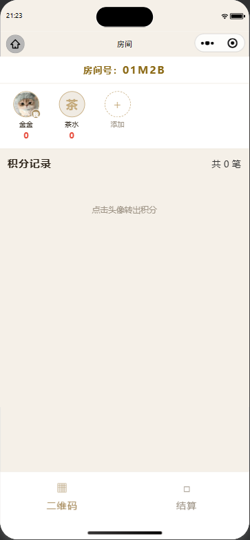
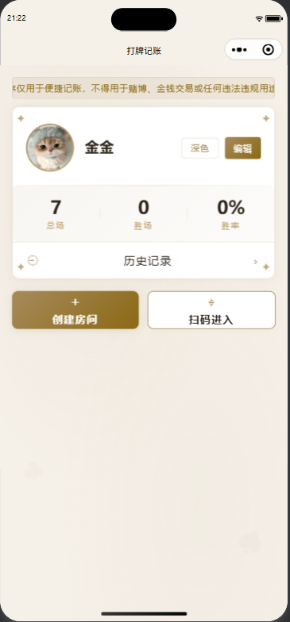
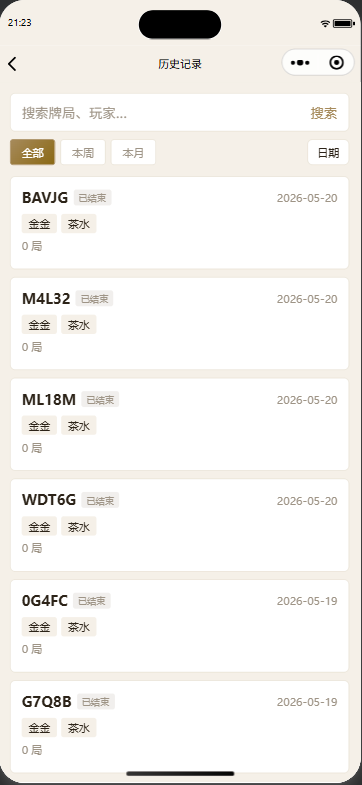
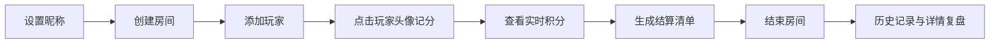

<div align="center">

# 打牌记账

轻量、克制、只为线下牌局记账的微信小程序


</div>

一款用于朋友局、家庭局等线下牌局的微信小程序记账工具。它只负责记录积分变化、保留牌局历史和生成结算参考，不提供支付、下注、撮合或任何资金交易能力。

> 本项目仅用于便捷记账与复盘统计，不得用于赌博、金钱交易或任何违法违规用途。

## 界面预览

<p align="center">
  
  
  
</p>

## 一句话说明

朋友开局时快速建房，牌局过程中点头像记分，结束时自动算出谁该向谁结算，之后还能回到历史记录里查每一局。

## 项目定位

打牌记账的目标是把线下牌局里最容易出错的部分做简单：谁转给谁、当前每个人多少分、最后怎么结算、历史记录怎么查。整个产品围绕“快速开局、轻量录入、自动汇总、可追溯历史”设计。

| 模块 | 说明 |
| --- | --- |
| 首页 | 用户资料、主题切换、统计概览、未结算房间入口 |
| 房间 | 玩家管理、积分录入、房间号分享、结算清单 |
| 历史 | 牌局搜索、日期筛选、本周/本月筛选、分页加载 |
| 详情 | 最终排名、每轮记录、牌局删除 |
| 存储 | 本地分片存储、房间/牌局摘要、自动结算兜底 |

## 核心功能

- 创建房间：生成 5 位房间号，默认加入房主和茶水位。
- 添加玩家：支持局中追加玩家，自动维护玩家积分。
- 快速记账：点击玩家头像录入转出积分，自动生成双方分数变化。
- 自动结算：根据每位玩家净积分生成最少化结算清单。
- 历史归档：房间结束后自动生成牌局记录，用于详情和统计。
- 搜索筛选：支持按牌局、地点、备注、玩家名、日期范围筛选。
- 个人统计：按昵称统计总场数、胜场和胜率。
- 主题切换：浅色纸感风格和深色牌桌风格。
- 存储迁移：支持从旧列表式存储迁移到摘要 + 详情分片存储。
- 异常兜底：超过 12 小时未更新的进行中房间会自动结算归档。

## 使用流程



## 技术结构

```text
.
├── app.js / app.json / app.wxss
├── components
│   └── game-card              # 历史牌局卡片
├── pages
│   ├── index                  # 首页、用户资料、统计入口
│   ├── room                   # 房间、记分、结算
│   ├── history/list           # 历史列表和筛选
│   └── game/detail            # 牌局详情
└── utils
    └── storage.js             # 本地存储、统计、迁移、房间归档
```

## 数据设计

项目使用微信小程序本地存储，不依赖后端服务。

| Key | 用途 |
| --- | --- |
| `poker_user_profile` | 用户昵称与头像 |
| `poker_rooms` | 房间摘要列表 |
| `poker_room_{id}` | 房间完整数据 |
| `poker_games` | 已结束牌局摘要列表 |
| `poker_game_{id}` | 已结束牌局完整数据 |
| `poker_storage_version` | 存储结构版本 |

这种摘要 + 详情的结构可以避免列表页一次性读取完整 rounds 数据，降低本地存储读写压力。

## 本地运行

1. 使用微信开发者工具导入项目目录。
2. 确认 `project.config.json` 中的 `appid` 是否需要替换为自己的小程序 AppID。
3. 编译运行，入口页面为 `pages/index/index`。

私有开发配置 `project.private.config.json` 已加入 `.gitignore`，不会提交到远端仓库。

## 发布前检查

上线前建议至少完成以下检查：

- 微信开发者工具中完整编译通过。
- 真机预览覆盖浅色/深色主题。
- 验证创建房间、添加玩家、记分、结算、结束房间、历史详情。
- 检查小程序后台的服务类目、隐私协议和用户信息授权说明。
- 确认页面内合规提示可见，且产品不提供支付、下注、撮合、提现等功能。

## 当前验证记录

已完成的本地检查：

- JavaScript 语法检查通过。
- WXML 绑定事件和页面方法匹配。
- 主要业务流 mock 通过：建房、加人、记分、结算、结束、历史、详情、卡片跳转。
- 明显未使用样式已清理。
- `project.private.config.json` 未提交。

> 真实微信开发者工具渲染和真机表现仍应作为最终发布门槛。

## 合规声明

本项目是记账工具，不是博彩、支付或资金结算平台。项目中的“积分”“结算清单”等信息仅作为线下用户自行核对的记录参考，不代表真实资金交易指令，也不构成任何交易担保。

## 赞赏支持

<p align="center">
  
</p>
